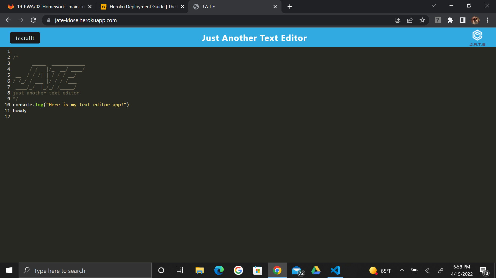
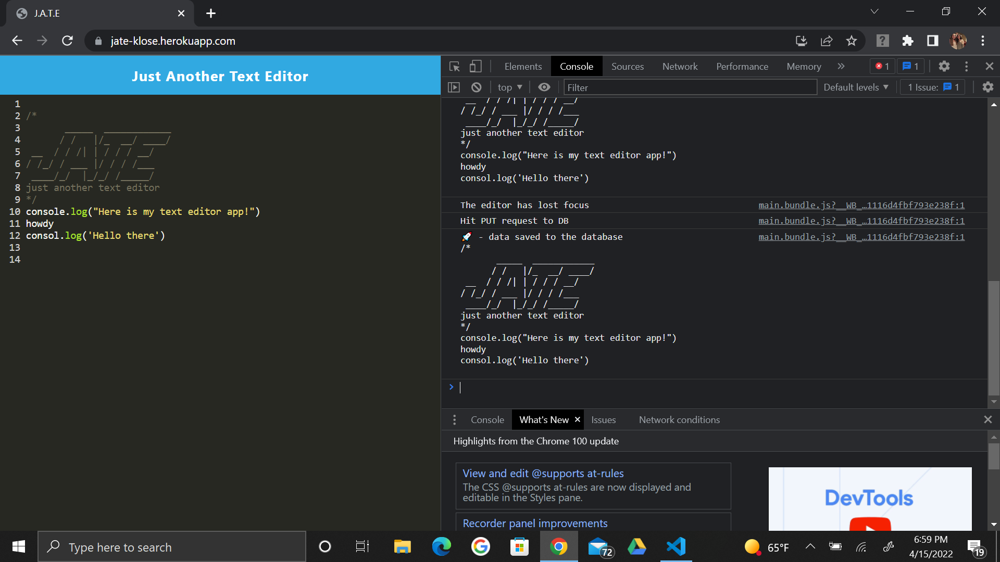
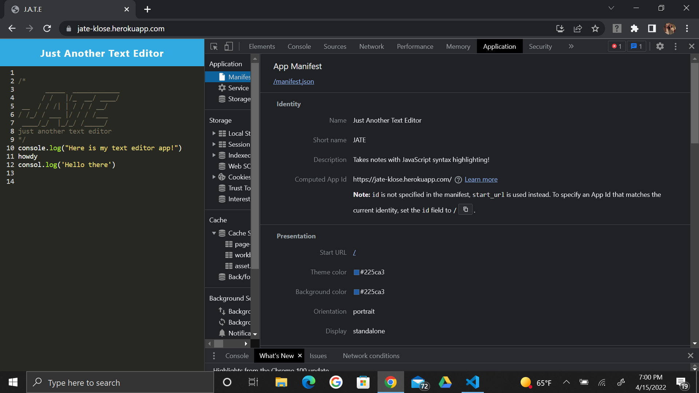

# PWA-Text-Editor

  ## Description
  The text editor is the perfect example of a progressive web application running in a user's browser! The app serves as a great place for users to write notes or snippets of code with or without internet connection. All notes will be saved to the database, and can be retrieved after refreshes or exitting and re-entering the app. Data is stored using an indexDB database, and utilizes many packages. Of which include:- but not limited to- several extentions of webpack plugins, babel and CSS loaders, idb -a wrapper for the API-, and concurrently to run client and server together! 

  ## Table of Contents

* [Installation](#installation)
* [Usage](#usage)
* [License](#license)
* [Contributing](#contributing)
* [Tests](#tests)
* [Questions](#questions)

## Installation
To install this application go through the following steps. 
1. Open or clone the repository to VSC. 
2. In main terminal run 'npm i' or 'npm install' to download the dependencies main package.json and for the client package.json. 
3. CD into server folder and run 'npm install' there. 
4. CD back to main and run 'npm build'
5. Run npm run start:dev from main to run app for both client & server.
* View the main package.json file to review commands and what they do. 

## Usage
Users can write code and/or comments in the text editor on or offline, and install/download the app to their computer to easily come back to later for their notes. Refer to the following link to view the the app in action, deployed with heroku, or use the visuals below for instruction for how the app works. Enjoy!

Deployed App: https://jate-klose.herokuapp.com/

 

 

 

## License
This application uses the ISC license 

## Contributing
If you are looking to add a contribution to this project you can visit this site for information: [Contributor Covenant](https://www.contributor-covenant.org/)

## Tests
There are currently no tests to run on this application.

## Questions

For any additional questions or issues, you can reach out to me 
via email at brittany.klose@yahoo.com
Otheriwise fee free to further view my work on my github page at [britt-klose](https://github.com/britt-klose/).